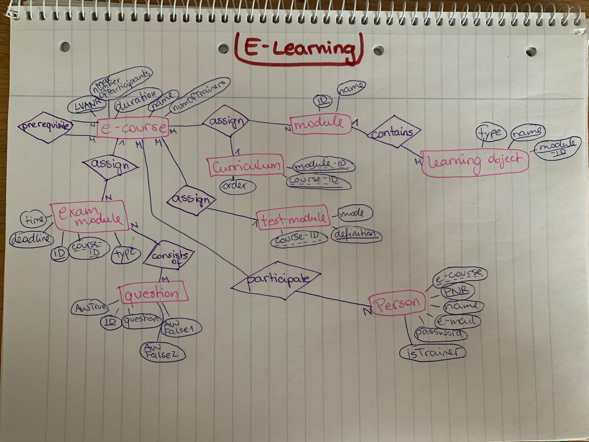
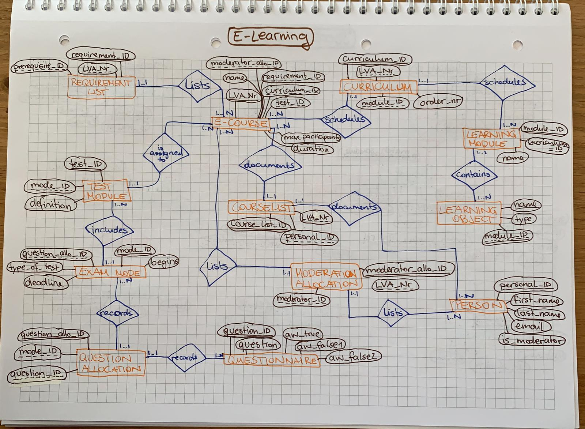

# E-Learning

The data structure of a new e-learning system is to be implemented. Draw the following facts in an ER diagram in Chen notation and create a relational model No null values are allowed.
An e-course is clearly identified by a course number (LVANR). In addition, a designation (NAME) is stored, a maximum number of participants (MAXIMUM) and the amount of time (SIZE) required to complete the course. It is noted which e-courses are a prerequisite for which other e-courses.
Learning modules have a name (NAME) and a unique identification number (ID). Courses are assigned several learning modules (at least one). Learning modules can be used for several courses. For each course the sequence (ORDER) of modules is noted.
Each learning module contains several learning objects (e.g. pictures, texts, videos). Learning objects are uniquely identified by the module to which they are assigned and their name (NAME). The type (TYPE) is also stored for learning objects.
In some cases, an e-course may also be assigned a test module (maximum). A mode (MODE) of a test module is known and a unique name (DEFINITION) - a test module can be assigned to several e-courses. MC tests, fees and external exams are exam modules. For each submission a deadline (DEADLINE) is also known. A time (TIME) is known for each MC test. An MC test consists of several questions. Questions are clearly identified by an identification number (FRAGEID). For this purpose, the text (QUESTION), one correct (AW TRUE) and two incorrect answers (AW FALSE1, AW FALSE2) must be stored, whereby a question can occur in several different MC tests.
Persons are uniquely identified by a personal number (PNR). The name (NAME) is also stored. Persons can participate in any number of courses. An e-course, is moderated by at least one and at most two persons, whereby one person can moderate a maximum of four courses.

## ER-Model:

* version 2

## Relational Model (version 2)

* E-Course (**LVA_Nr:int**, *curriculum_ID:int*, *test_ID:int*, *requirement_ID:int*, *moderator_allo_ID:int*, name:varchar(20), max_participants:int, duration:time)
* Requirementlist (**requirement_ID:int**, *LVA_Nr:int*, *prerequisite:int*)
* Learning Module (**module_ID:int**, *curriculum_ID:int*, name:varchar(20))
* Curriculum (**curriculum_ID:int**, *LVA_Nr:int*, *module_ID:int*, order_nr:int)
* Learning Object (**name:varchar(20)**, ***module_ID:int***, type:varchar(15))
* Test Module (**test_ID:int**, *mode_ID:int*, definition:varchar(20))
* Exam Mode (**mode_ID:int**, *question_allo_ID:int*, type_of_test:varchar(20), deadline:timestamp, begins:timestamp)
* Question Allocation (**question_allo_ID:int**, *mode_ID:int*, *question_ID:int*)
* Questionnaire (**question_ID:int**, question:text(300), aw_true:text(100), aw_false1:text(100), aw_false2:text(100))
* Person (**personal_ID:int**, first_name:varchar(20), last_name:varchar(20), email:varchar(30), is_moderator:boolean)
* Course List (**course_list_ID:int**, *LVA_Nr:int*, *personal_ID:int*)
* Moderator Allocation (**moderator_allo_ID:int**, *LVA_Nr:int*, *moderator_ID:int*)
